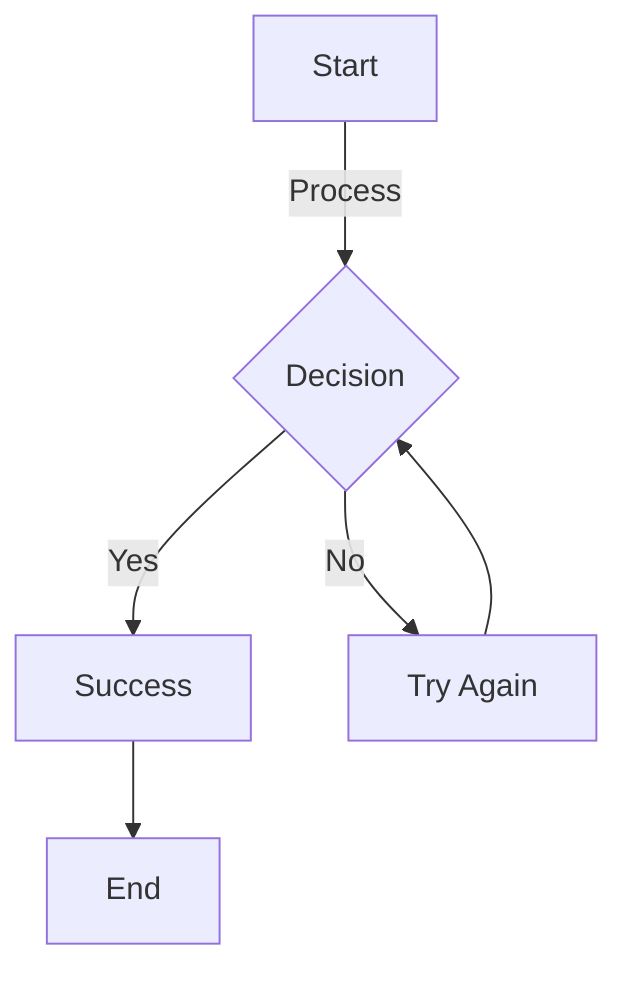
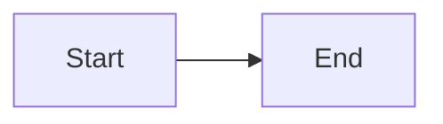
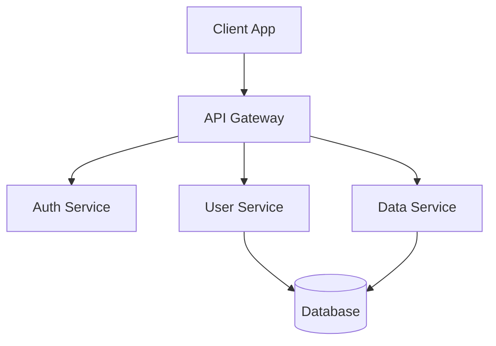
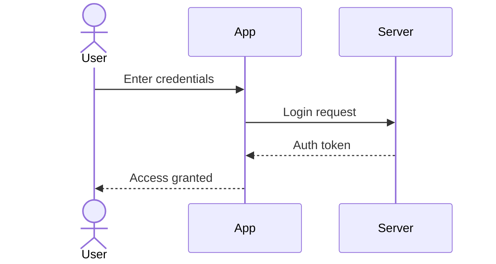
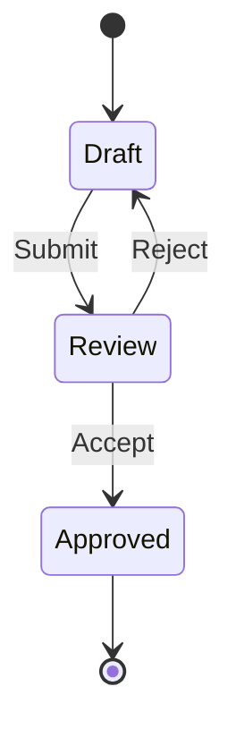

# Mermaid Diagram Examples

A comprehensive collection of Mermaid.js diagram examples for use in GitHub markdown files. Learn how to create beautiful, functional diagrams directly in your documentation.

## What is Mermaid?

Mermaid is a JavaScript-based diagramming tool that renders markdown-inspired text definitions to create diagrams dynamically. It's supported natively in GitHub, making it perfect for documentation.

## Quick Example



## Documentation Structure

### Flowcharts

Complete guide to creating flowcharts:

- [Node Shapes](./flowcharts/nodes.md) - All available node shapes and syntax
- [Links Between Nodes](./flowcharts/links-between-nodes.md) - Connecting nodes with various arrow styles
- [Themes](./flowcharts/themes.md) - Color themes and visual styling
- [Styling](./flowcharts/styling.md) - Custom colors, CSS classes, and advanced styling
- [Best Practices](./flowcharts/best-practices.md) - Tips for creating effective diagrams

### Sequence Diagrams

Visualize interactions between components:

- [Sequence Diagram Basics](./sequence-diagrams/basics.md) - Complete guide with practical examples

### Other Diagram Types

Explore additional diagram types:

- [Other Diagrams](./other-diagrams/README.md) - Class, state, ERD, Gantt, git graphs, and more

## Quick Start Guide

### 1. Basic Syntax

Create a code block with `mermaid` as the language:

````markdown

````

### 2. Choose Your Diagram Type

Common diagram types:

- `flowchart` - Process flows and decision trees
- `sequenceDiagram` - Interactions and message passing
- `classDiagram` - Object-oriented structures
- `stateDiagram-v2` - State machines
- `erDiagram` - Database schemas
- `gantt` - Project timelines
- `pie` - Data visualization
- `gitGraph` - Version control flows

### 3. View on GitHub

Push your markdown file to GitHub and view it in the browser. GitHub automatically renders Mermaid diagrams.

## Common Use Cases

### Software Architecture



### User Authentication Flow



### State Machine



## GitHub Compatibility

All examples in this repository are tested for GitHub compatibility. Note:

- Most standard features are fully supported
- Some experimental features may not render
- Always test on GitHub before finalizing

## Features

- **GitHub Ready** - All diagrams tested on GitHub
- **Comprehensive** - Covers all major diagram types
- **Practical** - Real-world examples and use cases
- **Best Practices** - Tips for maintainable diagrams
- **Well Organized** - Easy to navigate and find examples

## Resources

- [Mermaid.js Official Documentation](https://mermaid.js.org/)
- [Mermaid Live Editor](https://mermaid.live/) - Test your diagrams
- [Markdown Guide](https://www.markdownguide.org/)

## Contributing

Found an issue or want to add more examples? Contributions are welcome!

## License

This project is for educational purposes. Feel free to use these examples in your own projects.
