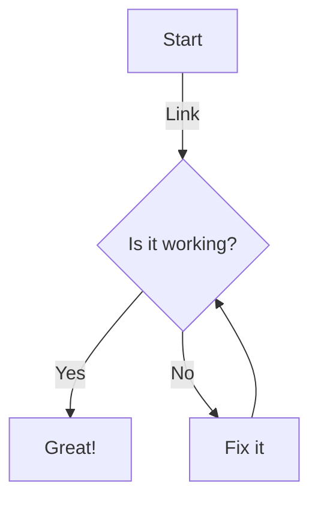

# demos_mermaid

Demos how to use mermaid in `README.md` files to generate diagrams in markdown files

## Example Flowchart

## How to Use

1. Create a new markdown file.
2. Add the Mermaid code block as shown in the example above.
3. Ensure you have Mermaid.js enabled in your markdown viewer.

### Documentation
- flowcharts
  - [themes](./flowcharts/themes.md)
  - [nodes](./flowcharts/nodes.md)
  - [links](./flowcharts/links-between-nodes.md)

  