# Mermaid Flowchart Best Practices

This guide provides tips and best practices for creating effective and maintainable Mermaid flowcharts.

## Table of Contents

- [Diagram Direction](#diagram-direction)
- [Node Naming Conventions](#node-naming-conventions)
- [Layout and Readability](#layout-and-readability)
- [Using Subgraphs](#using-subgraphs)
- [Common Pitfalls](#common-pitfalls)
- [Performance Tips](#performance-tips)
- [Accessibility](#accessibility)

## Diagram Direction

Choose the right direction for your flowchart based on the type of process:

### Top to Bottom (TD/TB) - Default and Recommended

Best for: Sequential processes, hierarchies, decision trees

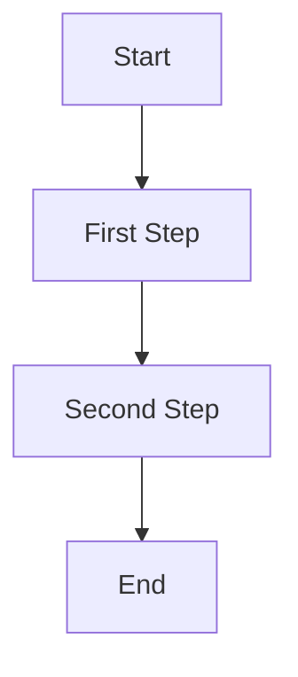

### Left to Right (LR)

Best for: Timeline processes, short workflows, wide displays

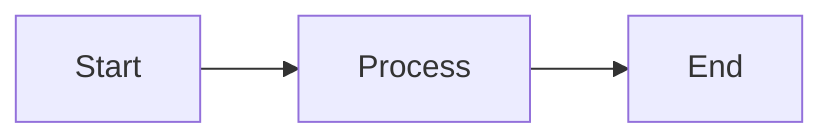

### Right to Left (RL) and Bottom to Top (BT)

Less common, use when specifically needed for visual flow:

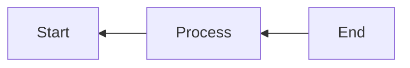

## Node Naming Conventions

### Use Meaningful IDs

**Good:**
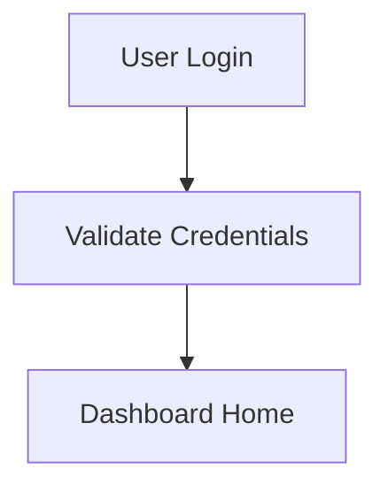

**Avoid:**

### Keep IDs Consistent

Use a consistent naming pattern throughout your diagram:
- camelCase: `userLogin`, `validateData`
- snake_case: `user_login`, `validate_data`
- PascalCase: `UserLogin`, `ValidateData`

## Layout and Readability

### Limit Node Connections

Avoid nodes with too many connections. Break complex flows into subgraphs:

**Better:**
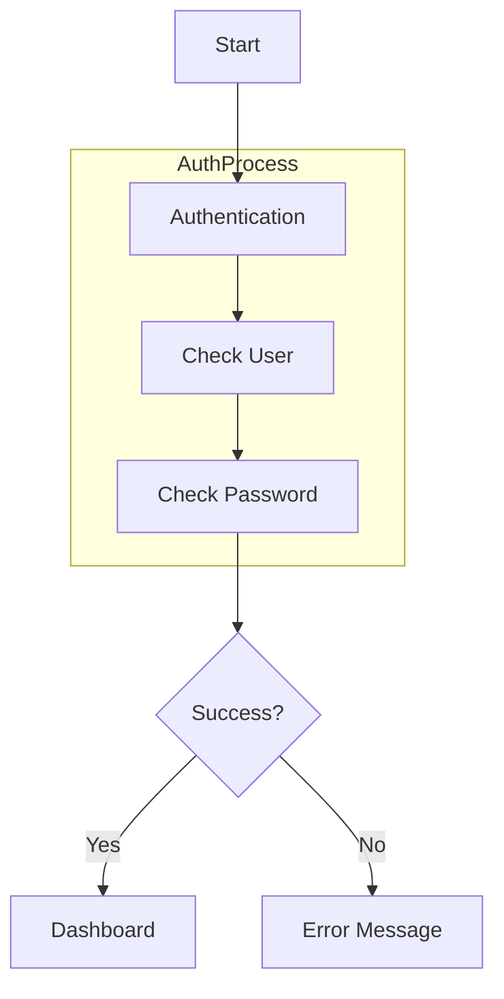

### Use Whitespace Appropriately

Break long diagrams into logical sections:

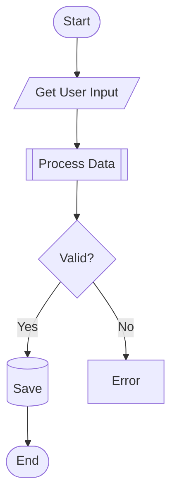

### Keep Text Labels Concise

**Good:** Short, clear labels
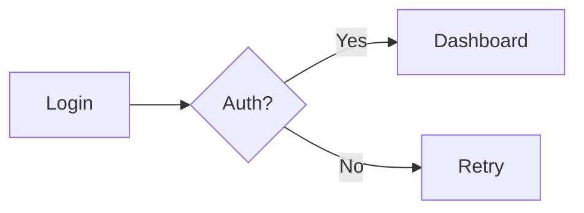

**Avoid:** Long, wordy labels
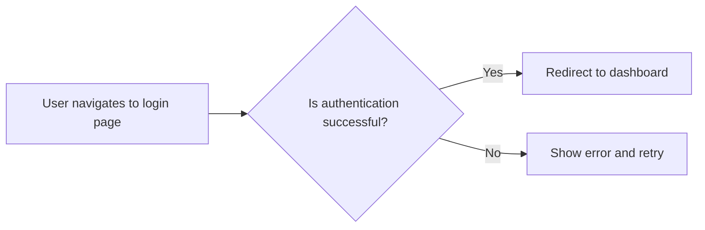

## Using Subgraphs

Organize complex diagrams with subgraphs:

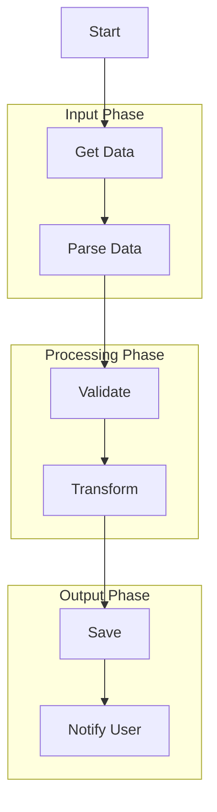

### Nested Subgraphs

For hierarchical organization:

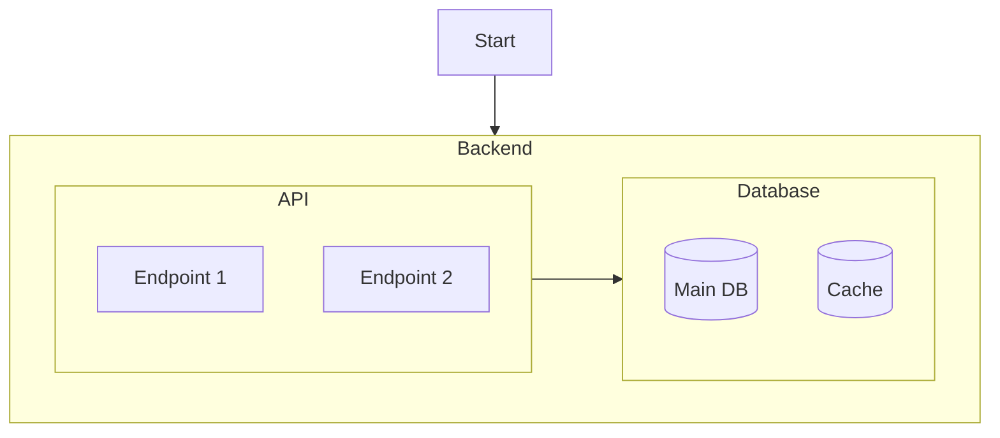

## Common Pitfalls

### Avoid Circular Dependencies Without Purpose

Ensure loops are intentional and have exit conditions:

**Good:**
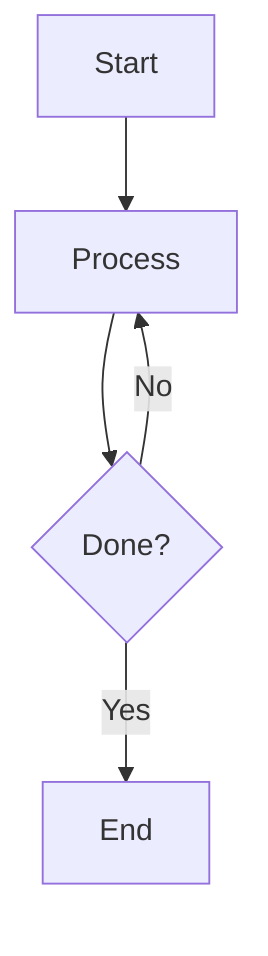

**Confusing:**
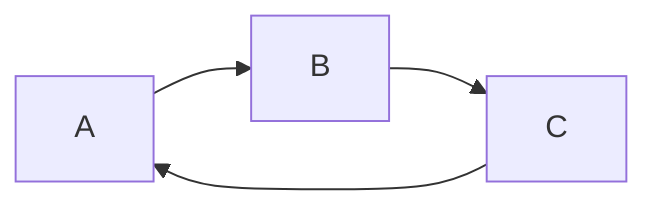

### Escape Special Characters

Use quotes for text with special characters:

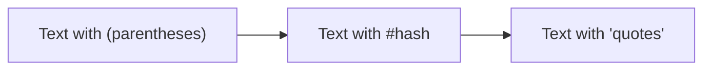

### Handle Long Text

Use markdown strings for better text formatting:

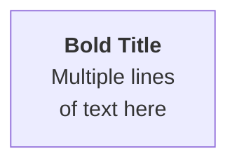

## Performance Tips

### Limit Diagram Size

Break very large diagrams into multiple smaller diagrams:
- Keep diagrams under 50 nodes when possible
- Use separate diagrams for different system components
- Link between diagrams in documentation

### Avoid Redundant Connections

**Inefficient:**
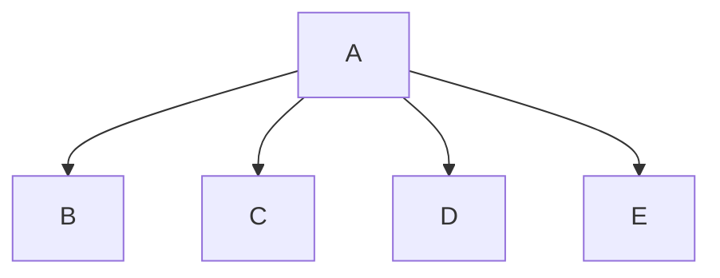

**Better:**
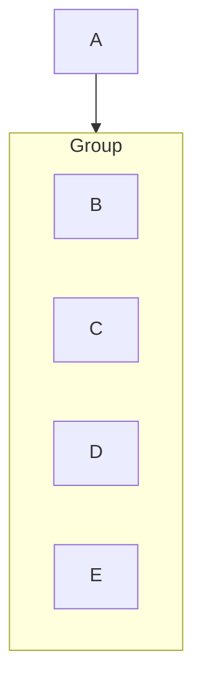

## Accessibility

### Use Descriptive Labels

Make your diagrams understandable without color:

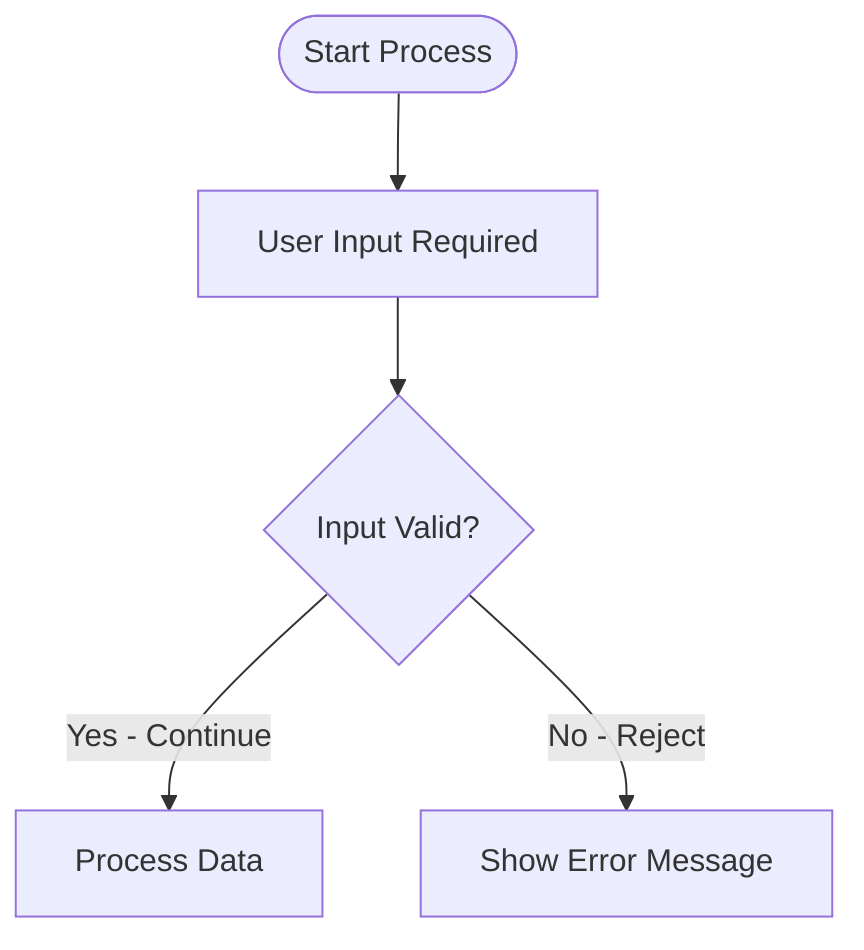

### Add Comments

Document complex sections:

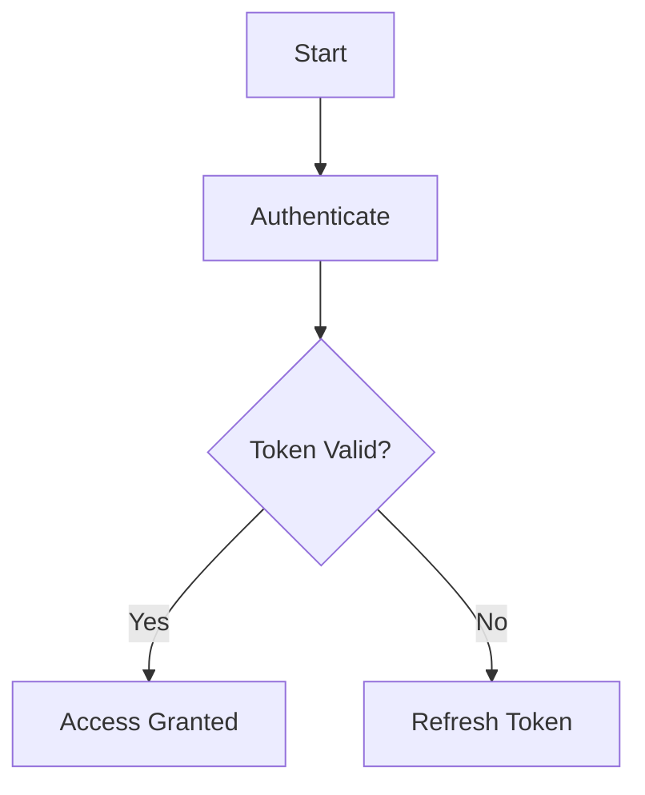

### Provide Context

Always accompany diagrams with text explanations:

**Example:**
This flowchart represents the user authentication process. Users first enter their credentials (Start), which are validated (Authenticate). If the token is valid, access is granted; otherwise, the system attempts to refresh the token.

## GitHub-Specific Tips

### Test Rendering

Always preview your diagrams on GitHub before committing:
1. Create a test branch
2. Push your markdown file
3. View on GitHub to ensure proper rendering
4. Some advanced features may not work on GitHub

### Use Compatible Syntax

Stick to well-supported features:
- Use standard node shapes
- Use `%%{init: ...}%%` for configuration
- Avoid experimental features
- Test theme compatibility

## Resources

- [Mermaid.js Documentation](https://mermaid-js.github.io/mermaid/#/)
- [Mermaid Best Practices Guide](https://mermaid.js.org/intro/)
- [Flowchart Design Principles](https://en.wikipedia.org/wiki/Flowchart)
