# Links Between Nodes in Mermaid

This document demonstrates how to create links between nodes using Mermaid.js in flowcharts.
## Table of Contents

- [A link with arrow head](#a-link-with-arrow-head)
- [An open link](#an-open-link)
- [Text on links](#text-on-links)
- [Dotted link](#dotted-link)
- [Dotted link with text](#dotted-link-with-text)
- [Thick link](#thick-link)
- [Thick link with text](#thick-link-with-text)
- [An invisible link](#an-invisible-link)
- [Chaining of links](#chaining-of-links)
- [Circle edge example](#circle-edge-example)
- [Cross edge example](#cross-edge-example)
- [Multi directional arrows](#multi-directional-arrows)
- [Minimum length of a link](#minimum-length-of-a-link)
- [Special characters that break syntax](#special-characters-that-break-syntax)
- [Entity codes to escape characters](#entity-codes-to-escape-characters)
- [Subgraphs](#subgraphs)
- [Subgraphs flowcharts](#subgraphs-flowcharts)
- [Direction in subgraphs](#direction-in-subgraphs)
- [Markdown Strings](#markdown-strings)
- [Comments](#comments)
- [Resources](#resources)

## A link with arrow head
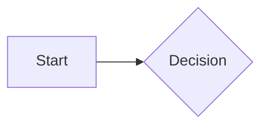

## An open link
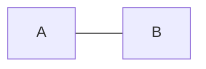

## Text on links
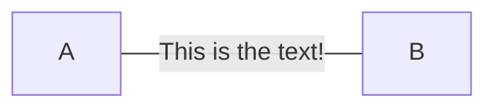

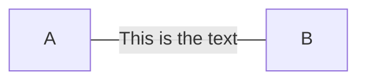


## Dotted link


## Dotted link with text
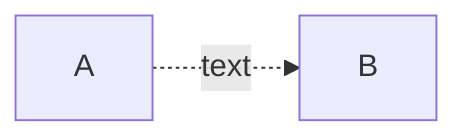

## Thick link
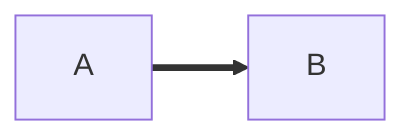

## Thick link with text
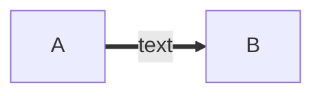

## An invisible link
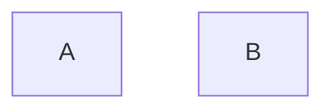

## Chaining of links
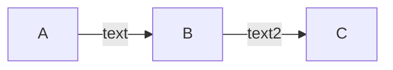

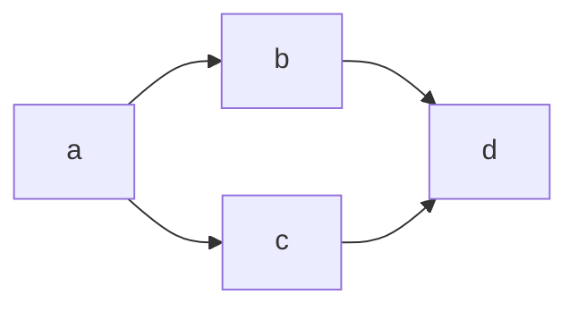

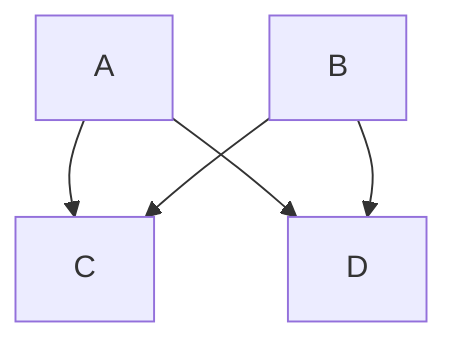


## Circle edge example
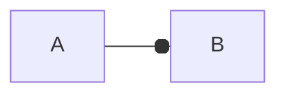

## Cross edge example
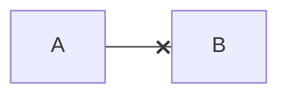

## Multi directional arrows
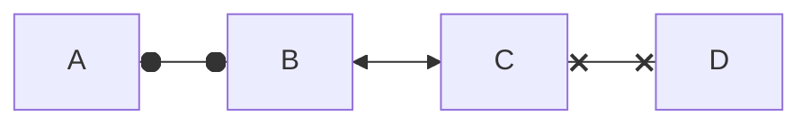

## Minimum length of a link
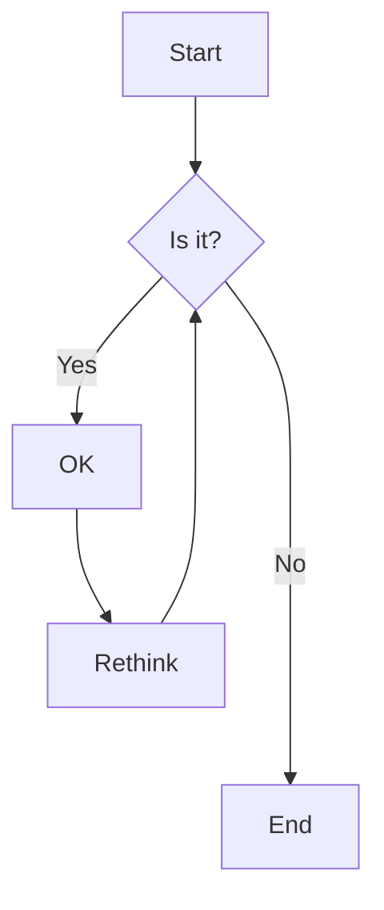


For dotted or thick links, the characters to add are equals signs or dots, as summed up in the following table:

| Length              | 1     | 2      | 3       |
|---------------------|-------|--------|---------|
| Normal              | ---   | ----   | -----   |
| Normal with arrow   | -->   | --->   | ---->   |
| Thick               | ===   | ====   | =====   |
| Thick with arrow    | ==>   | ===>   | ====>   |
| Dotted              | -.-   | -..-   | -...-   |
| Dotted with arrow   | -.->  | -..->  | -...->  |

## Special characters that break syntax
It is possible to put text within quotes in order to render more troublesome characters. As in the example below:


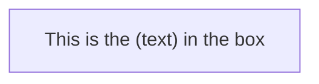
## Entity codes to escape characters
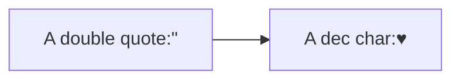

## Subgraphs

```
subgraph title
    graph definition
end
```

```mermaid
flowchart TB
    c1-->a2
    subgraph one
    a1-->a2
    end
    subgraph two
    b1-->b2
    end
    subgraph three
    c1-->c2
    end
```

```mermaid
flowchart TB
    c1-->a2
    subgraph ide1 [one]
    a1-->a2
    end
```

## Subgraphs flowcharts

```mermaid
flowchart TB
    c1-->a2
    subgraph one
    a1-->a2
    end
    subgraph two
    b1-->b2
    end
    subgraph three
    c1-->c2
    end
    one --> two
    three --> two
    two --> c2
```

## Direction in subgraphs
```mermaid
flowchart LR
  subgraph TOP
    direction TB
    subgraph B1
        direction RL
        i1 -->f1
    end
    subgraph B2
        direction BT
        i2 -->f2
    end
  end
  A --> TOP --> B
  B1 --> B2
```

Limitation

If any of a subgraph's nodes are linked to the outside, subgraph direction will be ignored. Instead the subgraph will inherit the direction of the parent graph:

```mermaid
flowchart LR
    subgraph subgraph1
        direction TB
        top1[top] --> bottom1[bottom]
    end
    subgraph subgraph2
        direction TB
        top2[top] --> bottom2[bottom]
    end
    %% ^ These subgraphs are identical, except for the links to them:

    %% Link *to* subgraph1: subgraph1 direction is maintained
    outside --> subgraph1
    %% Link *within* subgraph2:
    %% subgraph2 inherits the direction of the top-level graph (LR)
    outside ---> top2
```

## Markdown Strings
```mermaid
%%{init: {"flowchart": {"htmlLabels": false}} }%%
flowchart LR
subgraph "One"
  a("`The **cat**
  in the hat`") -- "edge label" --> b{{"`The **dog** in the hog`"}}
end
subgraph "`**Two**`"
  c("`The **cat**
  in the hat`") -- "`Bold **edge label**`" --> d("The dog in the hog")
end
```

Formatting:

For bold text, use double asterisks (**) before and after the text.
For italics, use single asterisks (*) before and after the text.
With traditional strings, you needed to add <br> tags for text to wrap in nodes. However, markdown strings automatically wrap text when it becomes too long and allows you to start a new line by simply using a newline character instead of a <br> tag.
This feature is applicable to node labels, edge labels, and subgraph labels.

The auto wrapping can be disabled by using
```
---
config:
  markdownAutoWrap: false
---
graph LR

```

## Comments
```mermaid
flowchart LR
%% this is a comment A -- text --> B{node}
   A -- text --> B -- text2 --> C
```

## Resources

- [Mermaid.js Documentation](https://mermaid-js.github.io/mermaid/#/)
- [Mermaid.js Links Documentation](https://mermaid.js.org/syntax/flowchart.html#links-between-nodes)
- [Markdown Guide](https://www.markdownguide.org/)

