# Basic node examples

This document demonstrates how to create nodes using Mermaid.js in flowcharts.

## Table of Contents

- [Default node](#default-node)
- [Text node](#text-node)
- [Unicode text node](#unicode-text-node)
- [Markdown text node](#markdown-text-node)
- [Round edges node](#round-edges-node)
- [Stadium-shaped node](#stadium-shaped-node)
- [Subroutine shape node](#subroutine-shape-node)
- [Cylindrical shape node](#cylindrical-shape-node)
- [Circle node](#circle-node)
- [Asymmetric shape node](#asymmetric-shape-node)
- [Rhombus node](#rhombus-node)
- [Hexagon node](#hexagon-node)
- [Parallelogram node](#parallelogram-node)
- [Parallelogram alt node](#parallelogram-alt-node)
- [Trapezoid node](#trapezoid-node)
- [Trapezoid alt node](#trapezoid-alt-node)
- [Double circle node](#double-circle-node)
- [New shape node examples](#new-shape-node-examples)
- [Resources](#resources)

## Default node

```mermaid
flowchart LR
    id
 ```   

## Text node

```mermaid
flowchart LR
    id1[This is the text in the box]

 ```   

## Unicode text node
```mermaid
flowchart LR
    id["This ❤ Unicode"]
```

## Markdown text node
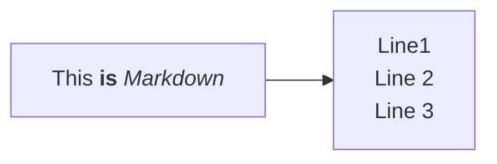

## Round edges node
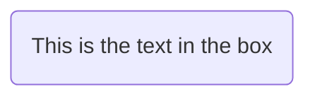

## Stadium-shaped node
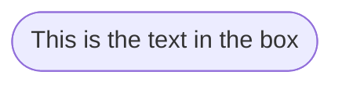

## Subroutine shape node
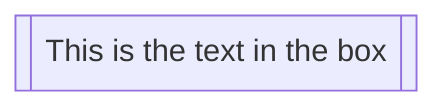

## Cylindrical shape node
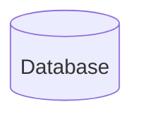

## Circle node
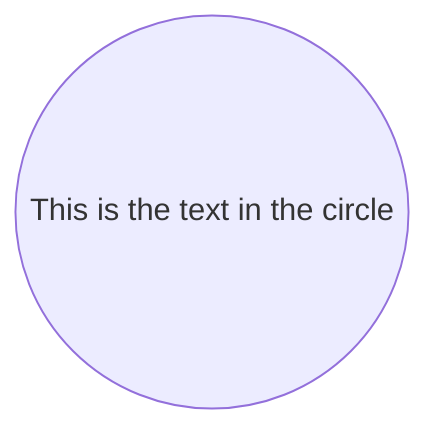


## Asymmetric shape node
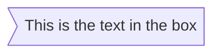

## Rhombus node
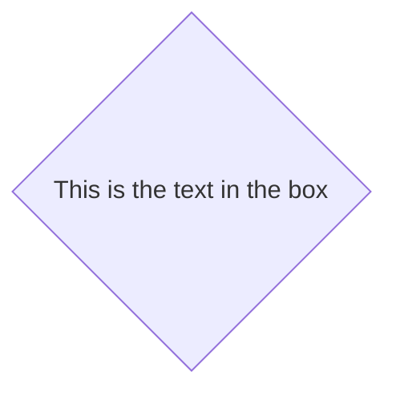

## Hexagon node
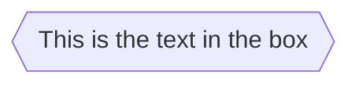

## Parallelogram node
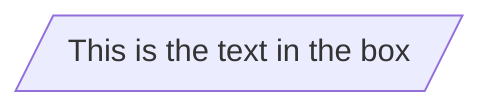

## Parallelogram alt node
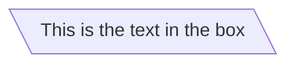

## Trapezoid node
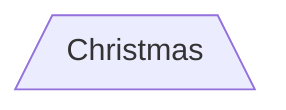

## Trapezoid alt node
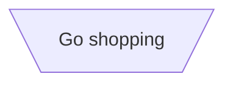

## Double circle node
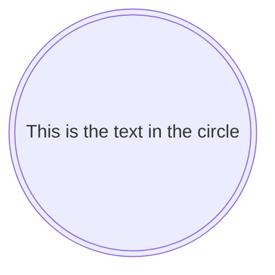

## Double circle node


### New shape node examples

```mermaid
flowchart RL
    card@{ shape: card, label: "Card Example"}
    hourglass@{ shape: hourglass, label: "Hour glass"}
    bolt@{ shape: bolt, label: "Lightning Bolt"}
    comment@{ shape: comment, label: "Comment"}
    braces@{ shape: braces, label: "Braces"}
    lean-r@{ shape: lean-r, label: "lean-r"}
    lean-l@{ shape: lean-l, label: "lean-l"}
    database@{ shape: database, label: "database"}
    decision@{ shape: decision, label: "decision"}
    delay@{ shape: delay, label: "delay"}
    cylinder@{ shape: cylinder, label: "cylinder"}
    disk@{ shape: disk, label: "disk"}
    display@{ shape: display, label: "display"}
    process@{ shape: process, label: "process"}
    doc@{ shape: doc, label: "doc"}
    event@{ shape: event, label: "event"}
    triangle@{ shape: triangle, label: "triangle"}
    fork@{ shape: fork, label: "fork"}
    window-pane@{shape: window-pane, label: "window-pane"}
    filled-circle@{shape: filled-circle, label: "filled-circle"}
    lined-document@{shape: lined-document, label:"lined-document"}
    shaded-process@{shape: shaded-process, label:"shaded-process"}
    loop-limit@{shape:loop-limit, label:"loop-limit"}
    manual-file@{shape: manual-file, label:"manual-file"}
    manual-input@{shape: manual-input, label:"manual-input"}
    manual@{shape:manual, label:"manual"}
    docs@{shape: documents, label:"documents"}
    processes@{shape: processes, label:"processes"}
    odd@{shape: odd, label:"odd"}
    flag@{shape: flag, label:"flag"}
    prepare@{shape: prepare, label:"prepare"}
    priority@{shape: priority, label:"priority"}
    start@{shape: circle, label:"circle"}
    start-small@{shape: small-circle, label:"small-circle"}
    stop-circle@{shape: double-circle, label:"double-circle"}
    stop@{shape: stop, label:"stop"}
    stored-data@{shape: stored-data, label:"stored-data"}
    subroutine@{shape: subroutine, label:"subroutine"}
    summary@{shape: summary, label:"summary"}
    tagged-document@{shape: tagged-document, label:"tagged-document"}
    tagged-process@{shape: tagged-process, label:"tagged-process"}
    terminal@{shape: terminal, label:"terminal"}
    text@{shape: text, label:"text block"}
```

## Resources

- [Mermaid.js Documentation](https://mermaid-js.github.io/mermaid/#/)
- [Mermaid.js Node Shape Documentation](https://mermaid.js.org/syntax/flowchart.html#node-shapes)
- [Markdown Guide](https://www.markdownguide.org/)
