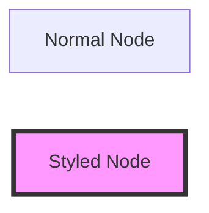
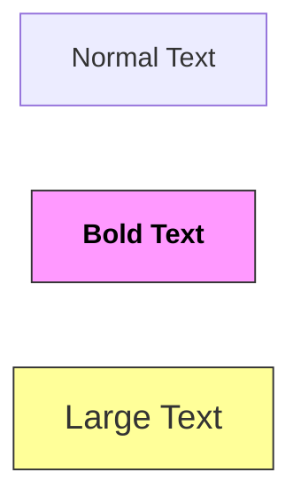
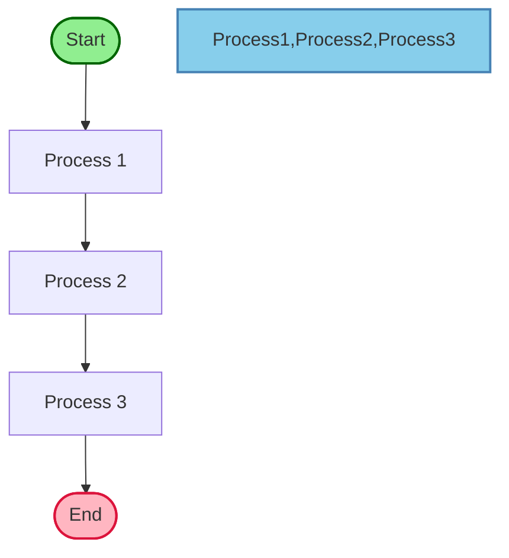
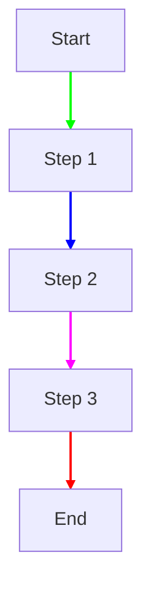
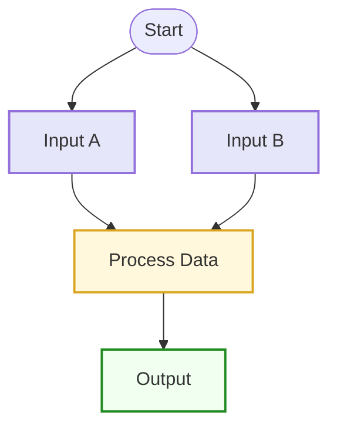
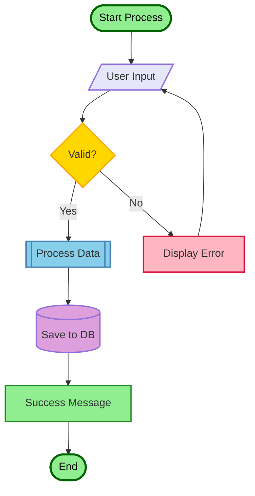

# Styling and Colors in Mermaid Flowcharts

This document demonstrates how to style nodes and links in Mermaid flowcharts using colors, CSS classes, and inline styles.

## Table of Contents

- [Basic Node Styling](#basic-node-styling)
- [Styling Individual Nodes](#styling-individual-nodes)
- [Styling Multiple Nodes](#styling-multiple-nodes)
- [Link Styling](#link-styling)
- [Using CSS Classes](#using-css-classes)
- [Color Examples](#color-examples)
- [Resources](#resources)

## Basic Node Styling

You can style individual nodes using the `style` keyword followed by the node ID and CSS properties:

## Styling Individual Nodes

### Fill and Stroke Colors

### Text Styling

## Styling Multiple Nodes

Style multiple nodes at once by listing their IDs separated by commas:

## Link Styling

### Basic Link Styling

### Multiple Link Styles

## Using CSS Classes

Define and apply CSS classes to nodes:

### Applying Classes to Multiple Nodes

## Color Examples

### Using Hex Colors

### Common Color Palette

## Practical Example: Process Flow with Styling

## Resources

- [Mermaid.js Documentation](https://mermaid-js.github.io/mermaid/#/)
- [Mermaid Styling Documentation](https://mermaid.js.org/syntax/flowchart.html#styling-and-classes)
- [CSS Colors Reference](https://developer.mozilla.org/en-US/docs/Web/CSS/color_value)
