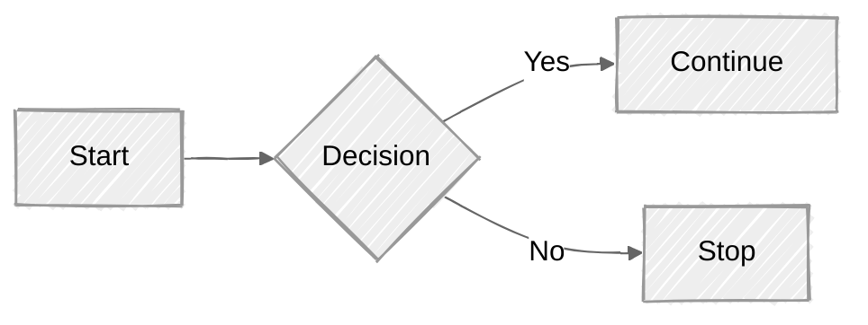
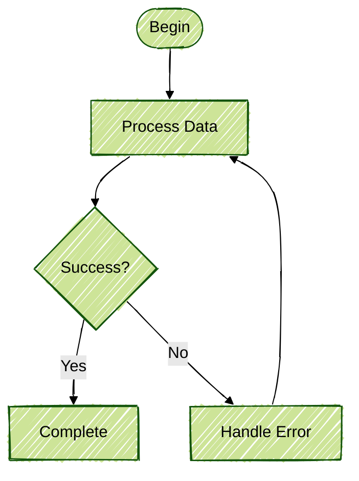

## Themes

Mermaid supports different visual themes and looks for your diagrams. This document demonstrates both the "look" styles and color themes.

## Table of Contents

- [Look Styles](#look-styles)
- [Color Themes](#color-themes)
- [Combining Look and Theme](#combining-look-and-theme)
- [Resources](#resources)

## Look Styles

### Hand Drawn Look

Creates a sketch-like appearance for a more casual, approachable feel:

### Classic Look

Standard polished appearance for professional diagrams:

## Color Themes

Mermaid supports several built-in color themes that work with both look styles.

### Default Theme

Standard blue accent theme:

### Neutral Theme

Minimal grayscale theme:

### Dark Theme

Dark background theme:

### Forest Theme

Green-themed design:

### Base Theme

Minimal base theme:

## Combining Look and Theme

You can combine any look style with any color theme. Here are some interesting combinations:

### Hand Drawn + Forest

### Hand Drawn + Dark

### Classic + Default (Professional Standard)

## Choosing the Right Theme

**Hand Drawn Look:**
- Best for: Brainstorming, informal documentation, creative projects
- Use when: You want to convey work-in-progress or invite feedback

**Classic Look:**
- Best for: Official documentation, technical specs, production diagrams
- Use when: You need a professional, polished appearance

**Theme Selection:**
- **default**: Safe choice for most use cases
- **neutral**: Minimal, works well in documentation with existing color schemes
- **dark**: Good for dark-mode documentation or presentations
- **forest**: Distinctive, use when you need visual separation from other content
- **base**: Maximum simplicity, good for printing

## Resources

- [Mermaid.js Theme Documentation](https://mermaid.js.org/config/theming.html)
- [Mermaid Configuration Options](https://mermaid.js.org/config/setup/modules/mermaidAPI.html)
- [Mermaid Live Editor](https://mermaid.live/) - Test themes interactively

