# Other Mermaid Diagram Types

Mermaid supports many diagram types beyond flowcharts and sequence diagrams. This directory contains examples of various diagram types.

## Available Diagram Types

### Class Diagrams

Show object-oriented class structures and relationships:

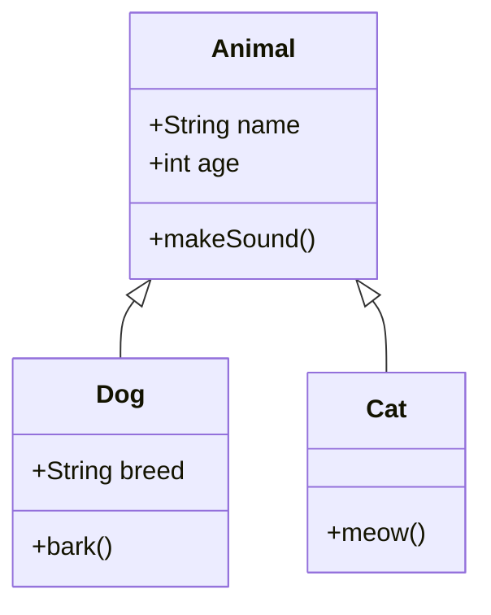

### State Diagrams

Visualize state machines and transitions:

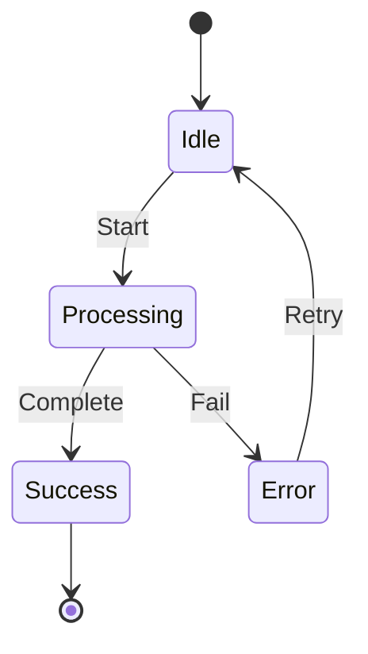

### Entity Relationship Diagrams (ERD)

Database schema and relationships:

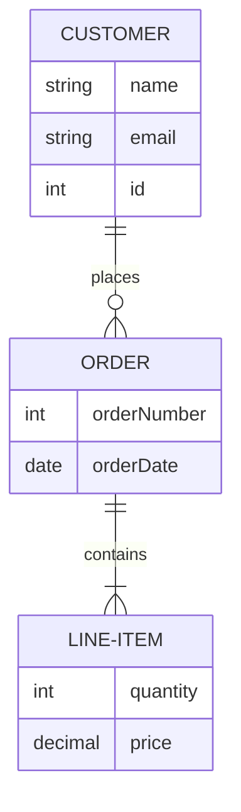

### Gantt Charts

Project timelines and schedules:

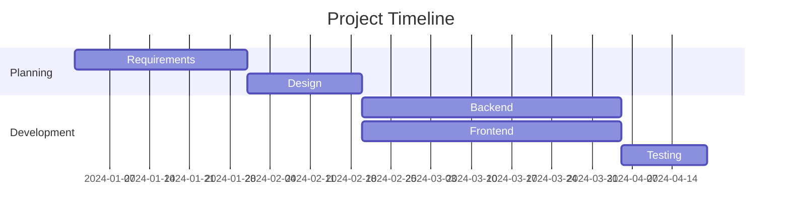

### Git Graph

Version control branching and merging:

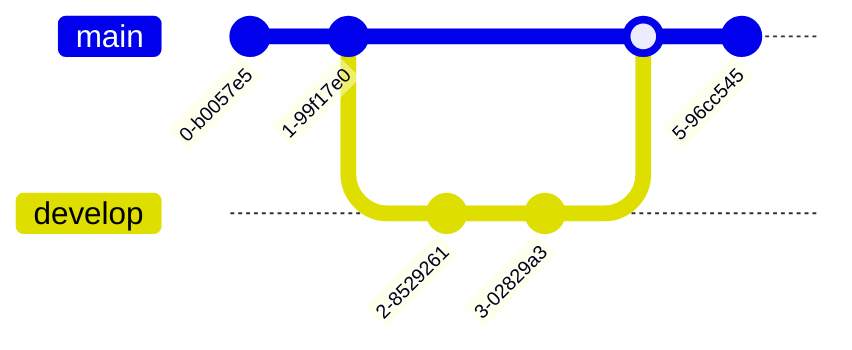

### Pie Charts

Data visualization:

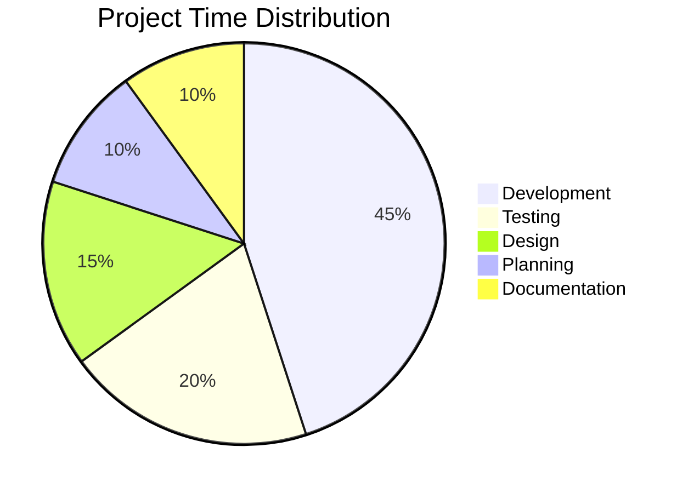

### User Journey

Map user experience flows:

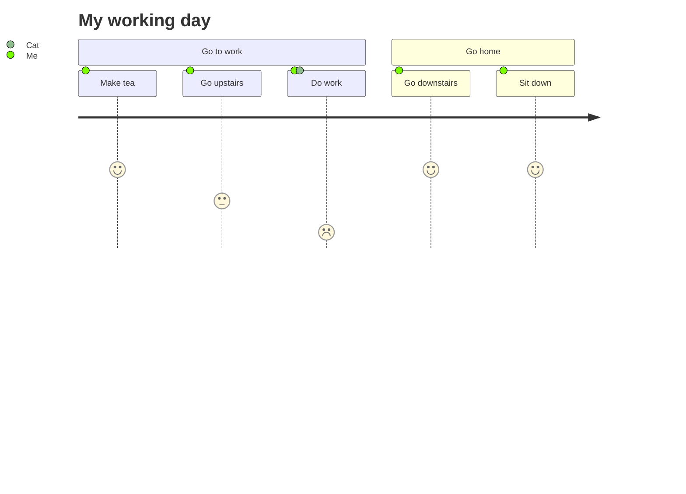

### Mindmap

Hierarchical concept mapping:

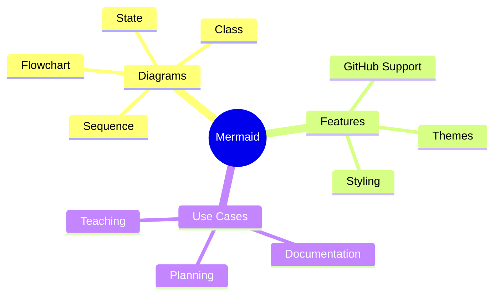

### Timeline

Linear event visualization:

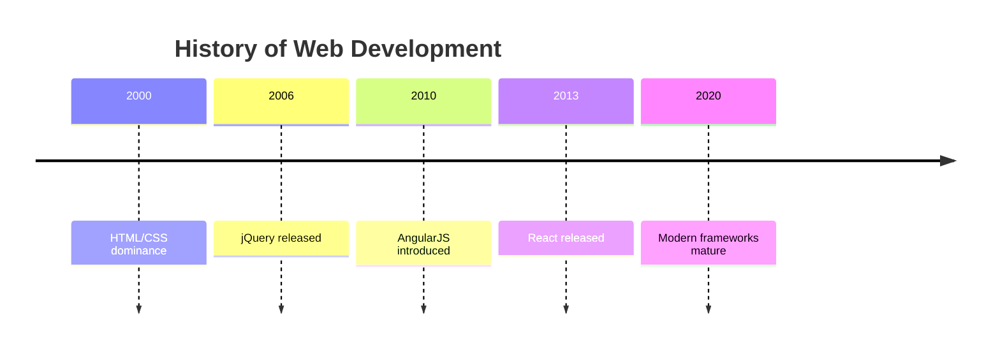

### Quadrant Chart

2D categorization:

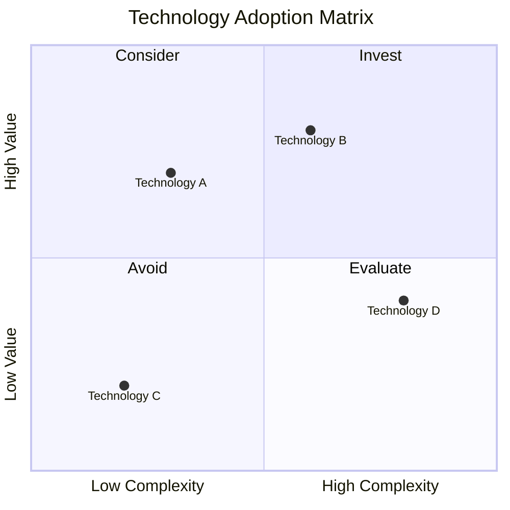

### Requirement Diagram

System requirements and relationships:

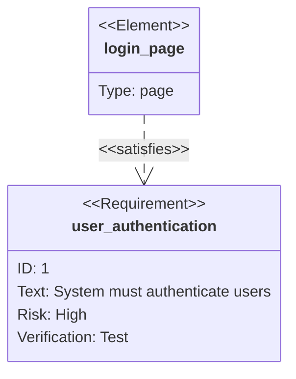

## GitHub Compatibility

Most of these diagram types are supported on GitHub, but some newer types may have limited support. Always test your diagrams on GitHub to ensure proper rendering.

**Well-supported on GitHub:**
- Flowcharts
- Sequence diagrams
- Class diagrams
- State diagrams
- Entity relationship diagrams
- Gantt charts
- Pie charts
- Git graphs

**May have limited support:**
- User journey
- Mindmap (newer feature)
- Timeline (newer feature)
- Quadrant chart (newer feature)
- Requirement diagrams

## Resources

- [Mermaid.js Documentation](https://mermaid.js.org/)
- [Mermaid Live Editor](https://mermaid.live/)
- [GitHub's Mermaid Support](https://github.blog/2022-02-14-include-diagrams-markdown-files-mermaid/)
