# Sequence Diagram Basics

Sequence diagrams show how processes interact with each other and in what order. They're particularly useful for visualizing API calls, user interactions, and system workflows.

## Table of Contents

- [Basic Syntax](#basic-syntax)
- [Participants](#participants)
- [Messages](#messages)
- [Activation](#activation)
- [Notes](#notes)
- [Loops and Conditionals](#loops-and-conditionals)
- [Practical Examples](#practical-examples)

## Basic Syntax

A simple sequence diagram with two participants:

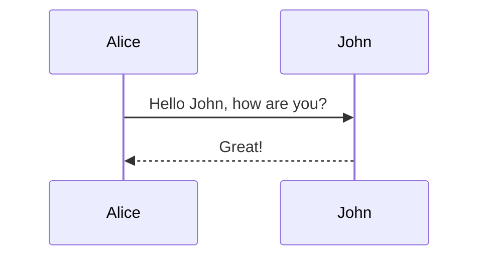
```mermaid
sequenceDiagram
    Alice->>John: Hello John, how are you?
    John-->>Alice: Great!
```

## Participants

### Defining Participants

You can explicitly define participants in order:

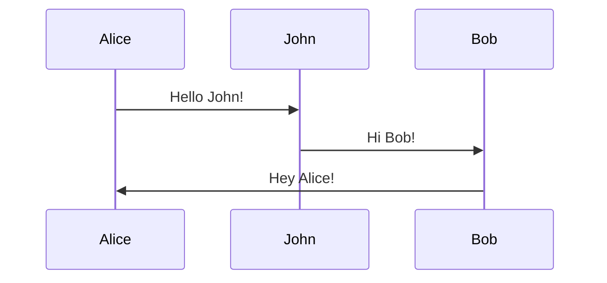
```mermaid
sequenceDiagram
    participant A as Alice
    participant J as John
    participant B as Bob

    A->>J: Hello John!
    J->>B: Hi Bob!
    B->>A: Hey Alice!
```

### Actor Notation

Use `actor` for human participants:

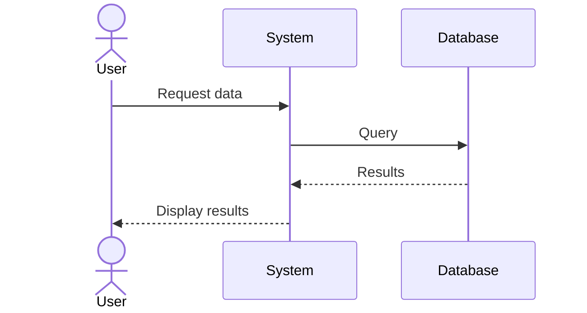
```mermaid
sequenceDiagram
    actor User
    participant System
    participant Database

    User->>System: Request data
    System->>Database: Query
    Database-->>System: Results
    System-->>User: Display results
```

## Messages

### Arrow Types

Different arrow styles represent different message types:

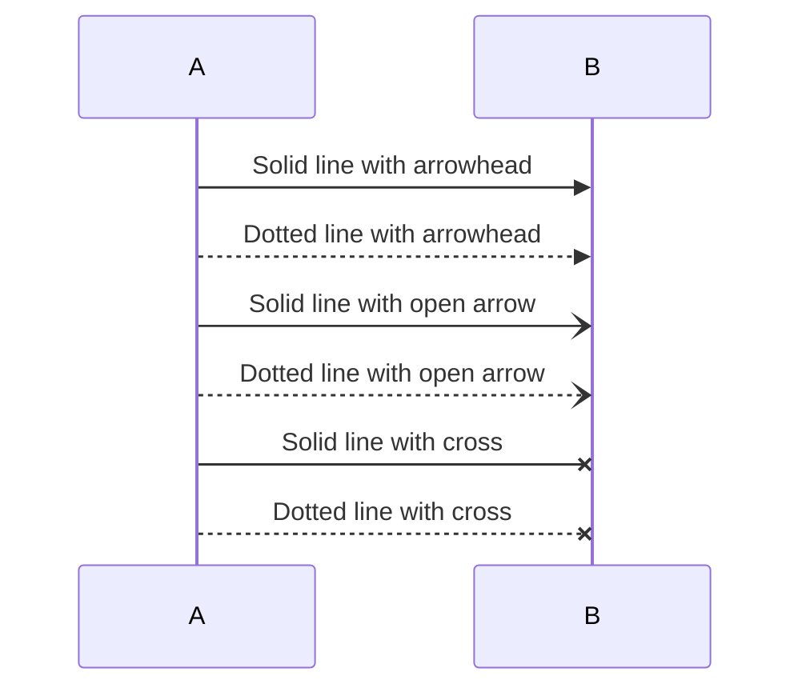
```mermaid
sequenceDiagram
    participant A
    participant B

    A->>B: Solid line with arrowhead
    A-->>B: Dotted line with arrowhead
    A-)B: Solid line with open arrow
    A--)B: Dotted line with open arrow
    A-xB: Solid line with cross
    A--xB: Dotted line with cross
```

### Message Labels

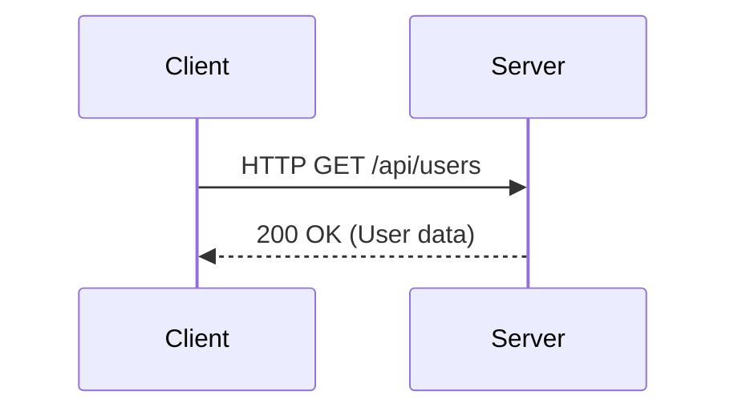
```mermaid
sequenceDiagram
    Client->>Server: HTTP GET /api/users
    Server-->>Client: 200 OK (User data)
```

## Activation

Show when a participant is actively processing:

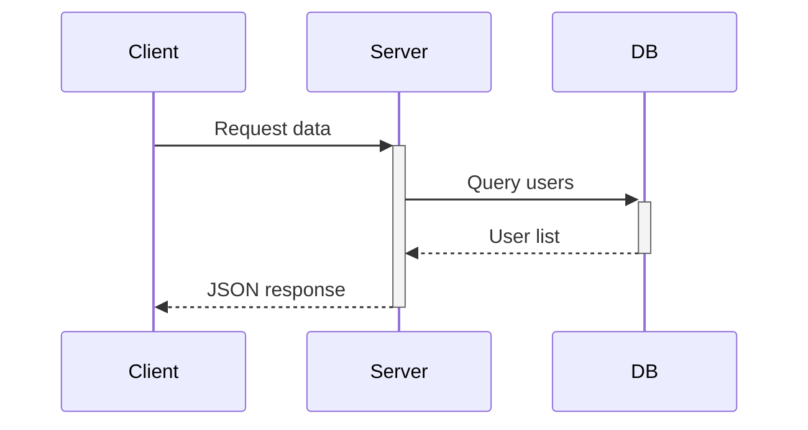
```mermaid
sequenceDiagram
    participant Client
    participant Server
    participant DB

    Client->>+Server: Request data
    Server->>+DB: Query users
    DB-->>-Server: User list
    Server-->>-Client: JSON response
```

### Manual Activation

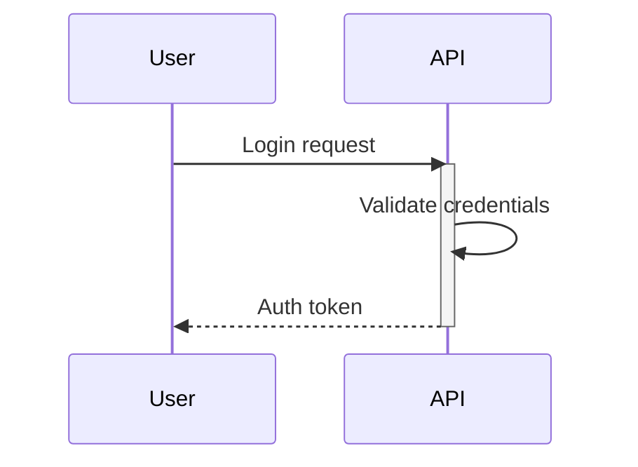
```mermaid
sequenceDiagram
    participant User
    participant API

    User->>API: Login request
    activate API
    API->>API: Validate credentials
    API-->>User: Auth token
    deactivate API
```

## Notes

Add explanatory notes to your diagram:

### Notes on One Side

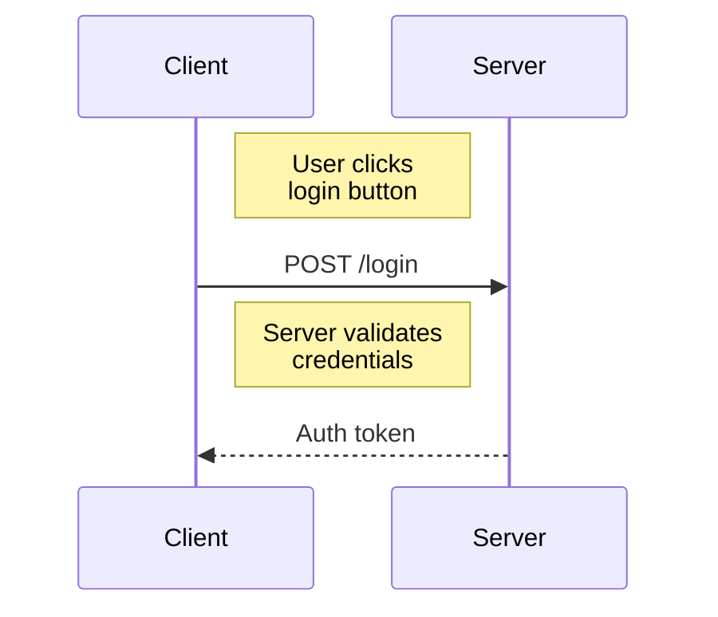
```mermaid
sequenceDiagram
    participant Client
    participant Server

    Note right of Client: User clicks<br/>login button
    Client->>Server: POST /login
    Note left of Server: Server validates<br/>credentials
    Server-->>Client: Auth token
```

### Notes Spanning Multiple Participants

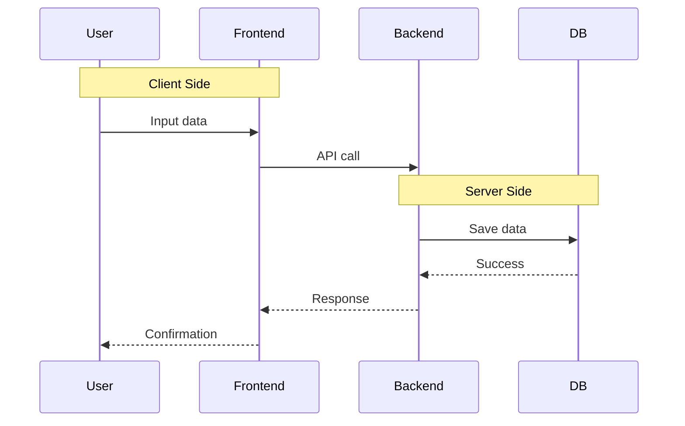
```mermaid
sequenceDiagram
    participant User
    participant Frontend
    participant Backend
    participant DB

    Note over User,Frontend: Client Side
    User->>Frontend: Input data
    Frontend->>Backend: API call

    Note over Backend,DB: Server Side
    Backend->>DB: Save data
    DB-->>Backend: Success
    Backend-->>Frontend: Response
    Frontend-->>User: Confirmation
```

## Loops and Conditionals

### Loop

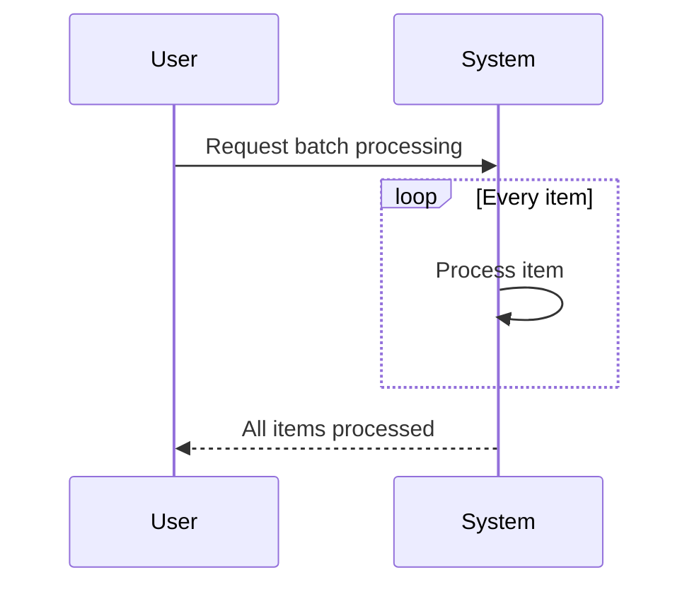
```mermaid
sequenceDiagram
    participant User
    participant System

    User->>System: Request batch processing
    loop Every item
        System->>System: Process item
    end
    System-->>User: All items processed
```

### Alt (Alternative Paths)

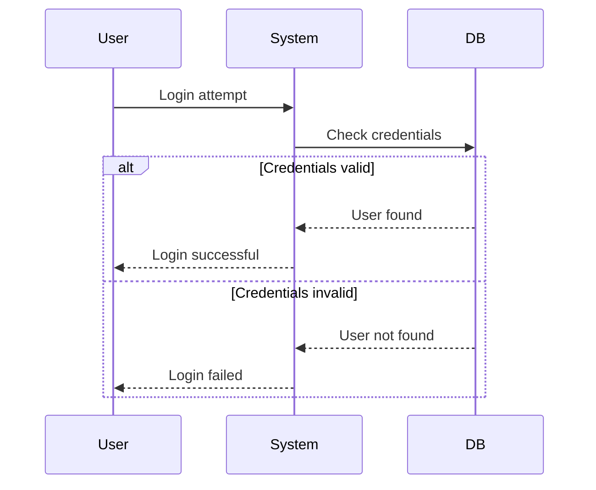
```mermaid
sequenceDiagram
    participant User
    participant System
    participant DB

    User->>System: Login attempt
    System->>DB: Check credentials

    alt Credentials valid
        DB-->>System: User found
        System-->>User: Login successful
    else Credentials invalid
        DB-->>System: User not found
        System-->>User: Login failed
    end
```

### Opt (Optional)

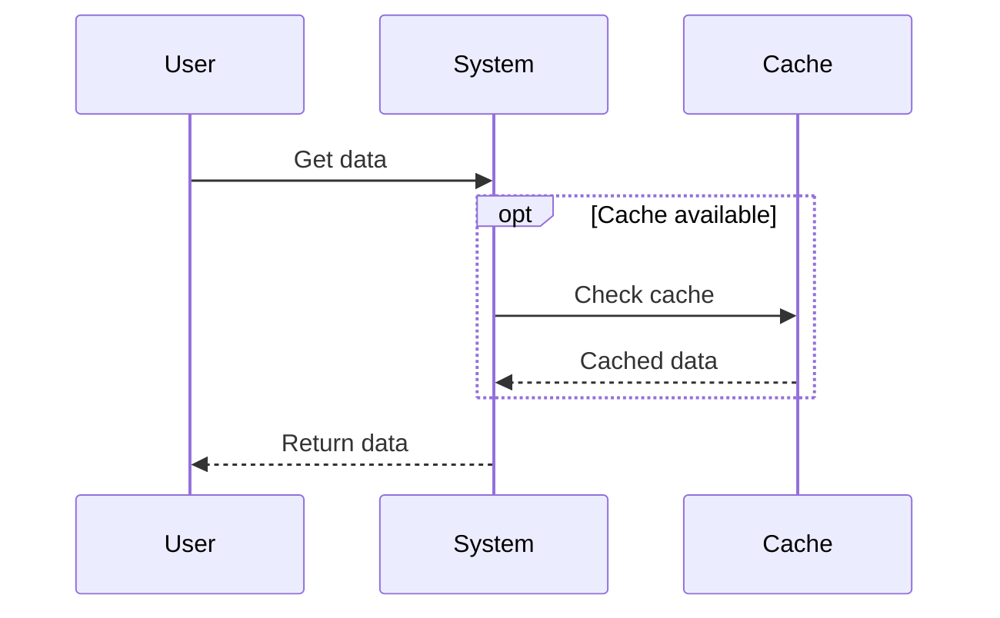
```mermaid
sequenceDiagram
    participant User
    participant System
    participant Cache

    User->>System: Get data
    opt Cache available
        System->>Cache: Check cache
        Cache-->>System: Cached data
    end
    System-->>User: Return data
```

### Par (Parallel)

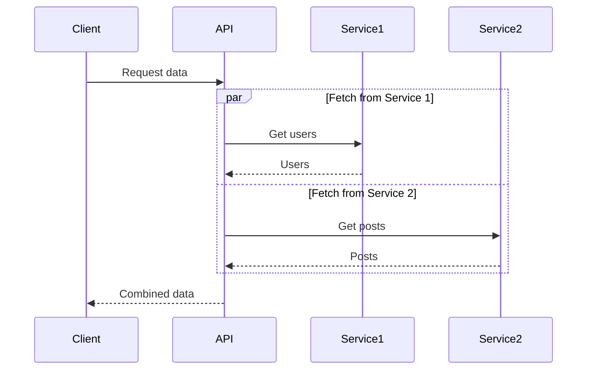
```mermaid
sequenceDiagram
    participant Client
    participant API
    participant Service1
    participant Service2

    Client->>API: Request data
    par Fetch from Service 1
        API->>Service1: Get users
        Service1-->>API: Users
    and Fetch from Service 2
        API->>Service2: Get posts
        Service2-->>API: Posts
    end
    API-->>Client: Combined data
```

## Practical Examples

### User Authentication Flow

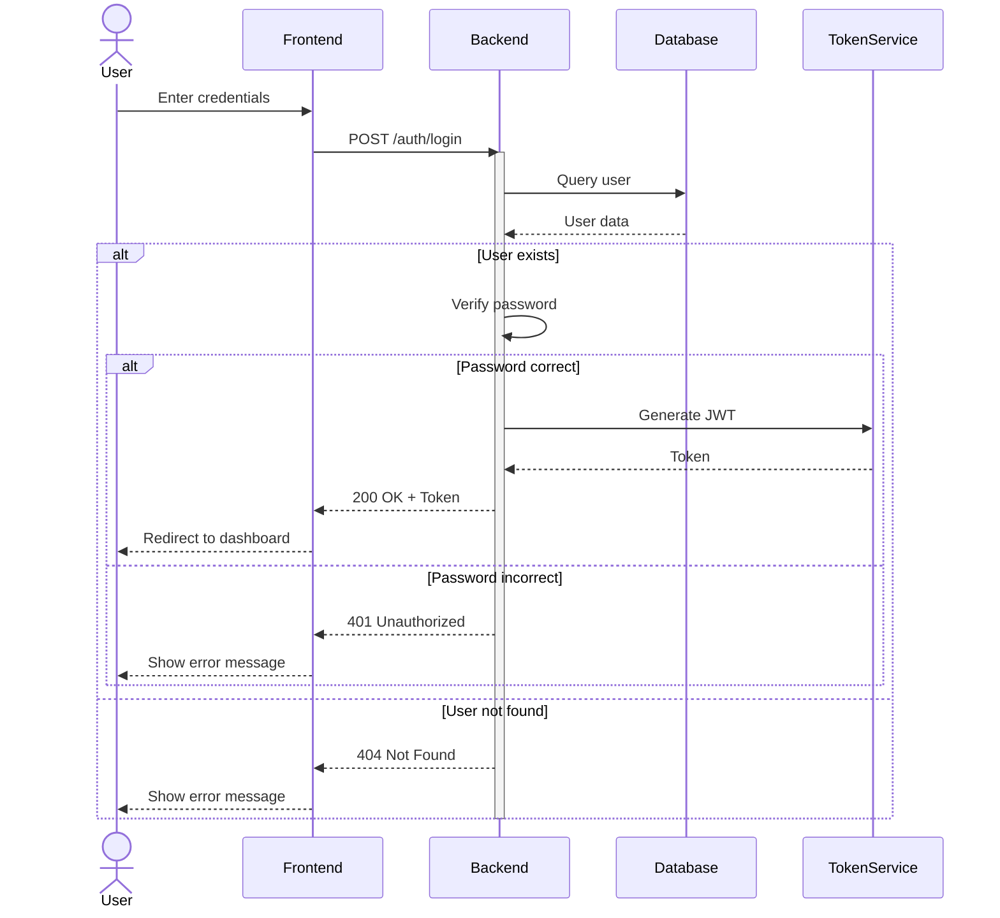
```mermaid
sequenceDiagram
    actor User
    participant Frontend
    participant Backend
    participant Database
    participant TokenService

    User->>Frontend: Enter credentials
    Frontend->>Backend: POST /auth/login
    activate Backend

    Backend->>Database: Query user
    Database-->>Backend: User data

    alt User exists
        Backend->>Backend: Verify password
        alt Password correct
            Backend->>TokenService: Generate JWT
            TokenService-->>Backend: Token
            Backend-->>Frontend: 200 OK + Token
            Frontend-->>User: Redirect to dashboard
        else Password incorrect
            Backend-->>Frontend: 401 Unauthorized
            Frontend-->>User: Show error message
        end
    else User not found
        Backend-->>Frontend: 404 Not Found
        Frontend-->>User: Show error message
    end

    deactivate Backend
```

### E-commerce Purchase Flow

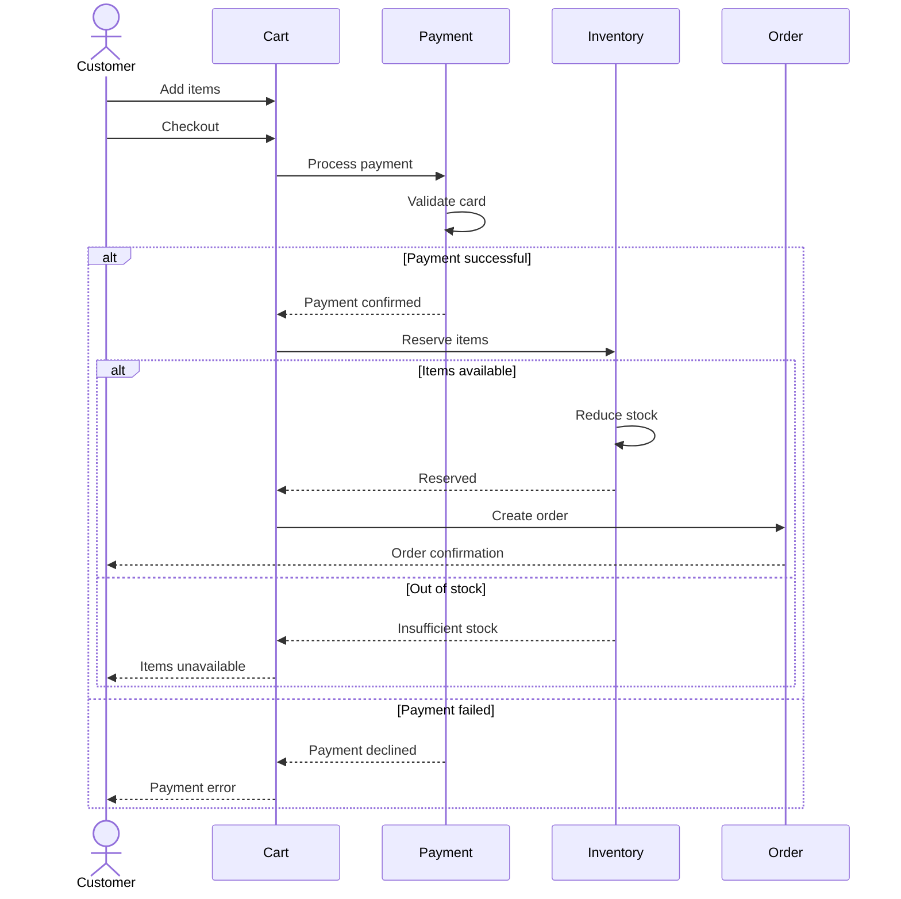
```mermaid
sequenceDiagram
    actor Customer
    participant Cart
    participant Payment
    participant Inventory
    participant Order

    Customer->>Cart: Add items
    Customer->>Cart: Checkout
    Cart->>Payment: Process payment

    Payment->>Payment: Validate card
    alt Payment successful
        Payment-->>Cart: Payment confirmed

        Cart->>Inventory: Reserve items
        alt Items available
            Inventory->>Inventory: Reduce stock
            Inventory-->>Cart: Reserved

            Cart->>Order: Create order
            Order-->>Customer: Order confirmation
        else Out of stock
            Inventory-->>Cart: Insufficient stock
            Cart-->>Customer: Items unavailable
        end
    else Payment failed
        Payment-->>Cart: Payment declined
        Cart-->>Customer: Payment error
    end
```

### API Rate Limiting

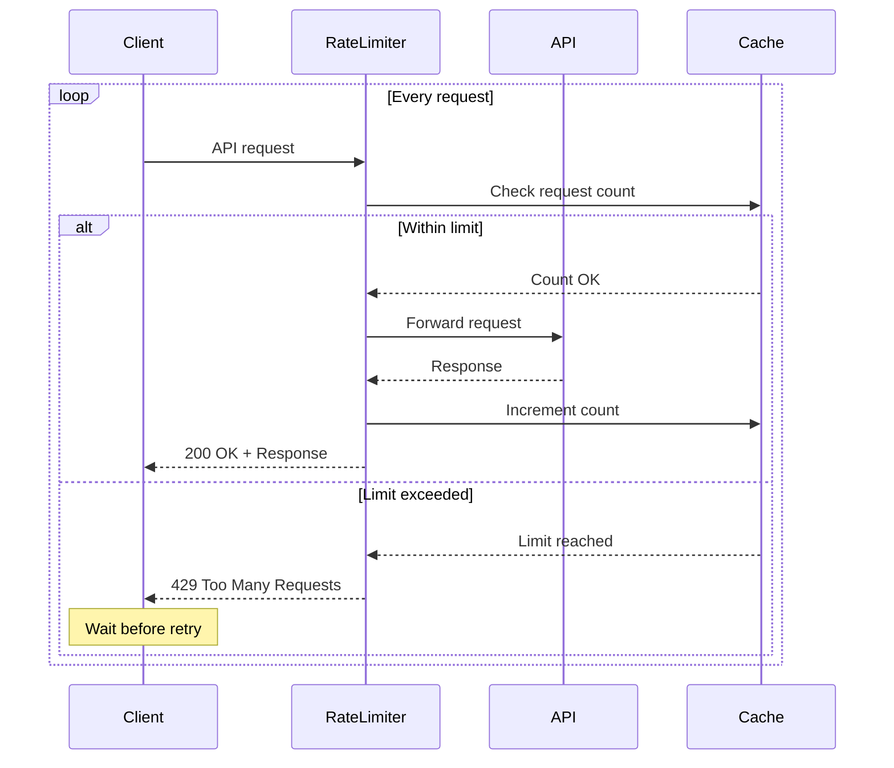
```mermaid
sequenceDiagram
    participant Client
    participant RateLimiter
    participant API
    participant Cache

    loop Every request
        Client->>RateLimiter: API request
        RateLimiter->>Cache: Check request count

        alt Within limit
            Cache-->>RateLimiter: Count OK
            RateLimiter->>API: Forward request
            API-->>RateLimiter: Response
            RateLimiter->>Cache: Increment count
            RateLimiter-->>Client: 200 OK + Response
        else Limit exceeded
            Cache-->>RateLimiter: Limit reached
            RateLimiter-->>Client: 429 Too Many Requests
            Note over Client: Wait before retry
        end
    end
```

### Microservices Communication

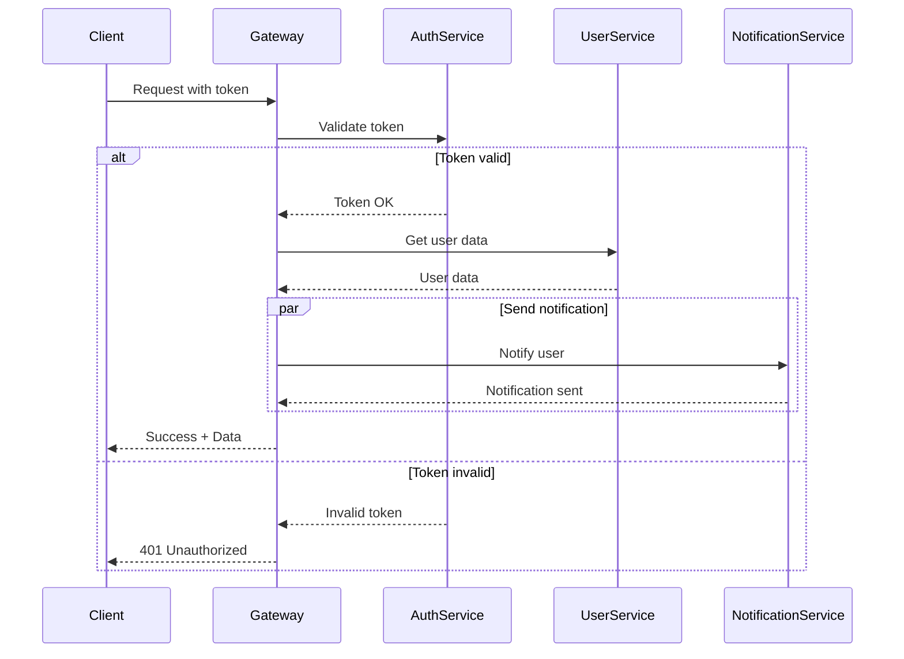
```mermaid
sequenceDiagram
    participant Client
    participant Gateway
    participant AuthService
    participant UserService
    participant NotificationService

    Client->>Gateway: Request with token
    Gateway->>AuthService: Validate token

    alt Token valid
        AuthService-->>Gateway: Token OK
        Gateway->>UserService: Get user data
        UserService-->>Gateway: User data

        par Send notification
            Gateway->>NotificationService: Notify user
            NotificationService-->>Gateway: Notification sent
        end

        Gateway-->>Client: Success + Data
    else Token invalid
        AuthService-->>Gateway: Invalid token
        Gateway-->>Client: 401 Unauthorized
    end
```

## Resources

- [Mermaid.js Sequence Diagram Documentation](https://mermaid.js.org/syntax/sequenceDiagram.html)
- [UML Sequence Diagrams](https://en.wikipedia.org/wiki/Sequence_diagram)
- [Mermaid Live Editor](https://mermaid.live/)
